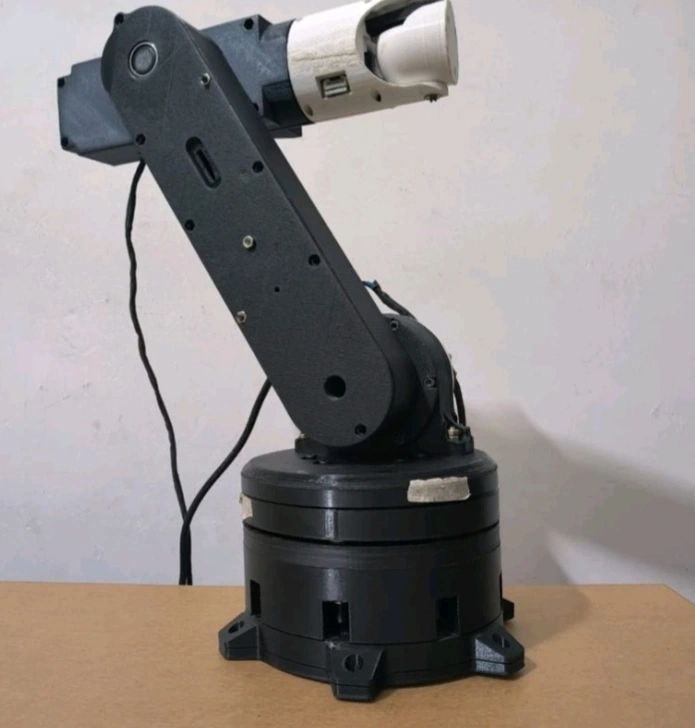
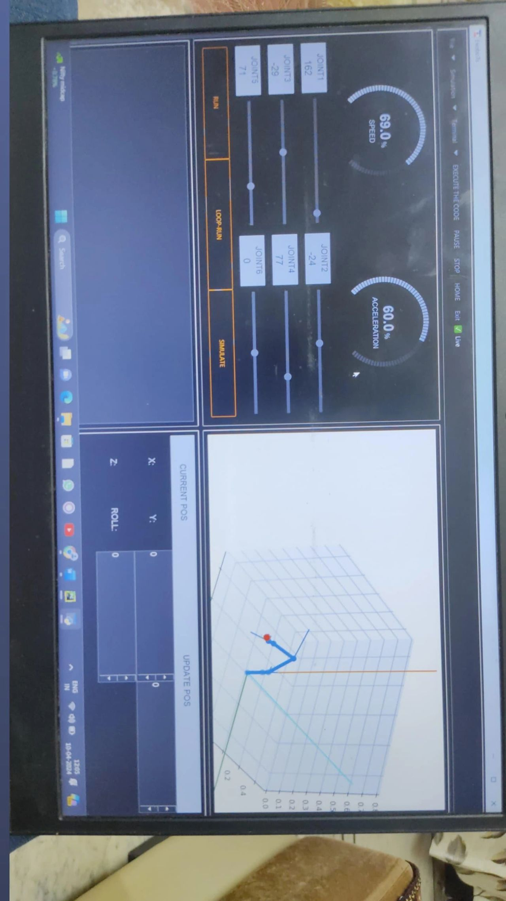
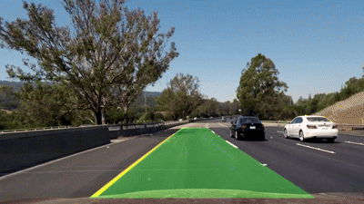
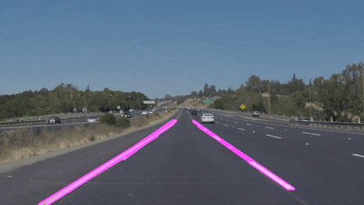

### Robotics | Artificial Intelligence | Computer Vision

📍 Punjab, India
📧 [harpreetsinghmunday782@gmail.co](mailto:harpreetsinghmunday782@gmail.com) 
🔗 [GitHub](https://github.com/harry2326)

---

## 🎯 Profile

I’m a Robotics and AI enthusiast with hands-on experience in computer vision, deep learning, embedded systems, and mechanical design, focused on building end-to-end intelligent systems.
I’m particularly interested in robot cognition, perception, autonomous systems, and learning-based control—and I enjoy building the “brain” that controls robots.

---

##  Featuring All Of My Projects

##  5-Axis Robotic Arm

**Overview:**
Designed and built a 5-axis robotic arm integrating mechanical systems, embedded control, and kinematics for precise motion.

 

  
**Key Highlights:**

* Custom 3D-printed structure with multi-stage gear reduction
* Cycloidal (19:1), planetary (11:1), GT2 belt (4:1), spur gear (2:1)
* Arduino UNO + TB6600 drivers for motor control
* Python GUI (Tkinter) with forward & inverse kinematics (IKPy)
* Real-time pose visualization using Matplotlib

**Features:**

* Joint control (−180° to +180°)
* Cartesian positioning (X, Y, Z) via inverse kinematics
* Speed & motion control with interactive GUI
* Serial communication between GUI and hardware

🎥 Demo: [Watch Robotic Arm Demo](https://drive.google.com/drive/folders/15EBxHBVPbexHDDdc4UJPTtGjX7ANmkdU?usp=sharing)

📂 Repo: [DETAILED_GIT_REPO](https://github.com/harry2326/5-Axis-Robotic-Arm-.git)

---

###  Lane Detection (Advanced)

 
**Techniques:**

* Camera calibration
* Perspective transform (Bird’s Eye View)
* Color & gradient thresholding
* Histogram-based lane detection
* Polynomial curve fitting

🎥 Demo: [Watch output](https://drive.google.com/file/d/1A0mEpByEhmucVunG-XNxy7urO6e3T9uC/view?usp=sharing)

📂 Repo: [DETAILED_GIT_REPO](https://github.com/harry2326/Advance_Lane_Detection.git)
Explanation_Video:[DETAILED_Explanation](https://drive.google.com/drive/folders/1gmGoDvOJ-CsIo6gUKX71LfIXFV2jvEOD?usp=sharing)

---

###  Lane Detection (Basic - Classical CV)

 
**Pipeline:**

* RGB → Grayscale
* Gaussian Blur
* Canny Edge Detection
* Hough Line Transform

🎥 Demo: [Watch output](https://drive.google.com/file/d/1Rk29r0IqFkadmuL8wZZcGJuSRmsnC2vz/view?usp=sharing)

📂 Repo: [DETAILED_GIT_REPO](https://github.com/harry2326/Basic_Lane_detection.git)
Explanation_Video:[DETAILED_Explanation](https://drive.google.com/drive/folders/1mM6702gmuPLONdZt8-PhSMzvr-EIoDAw?usp=sharing)

---

##  Machine Learning & Deep Learning

###  Perceptron from Scratch

* Implemented binary classifier without libraries
* Understood weight updates and convergence behavior
  
📂 Repo: [DETAILED_GIT_REPO](https://github.com/harry2326/Training_Perceptron_From_Scratch.git)

---

###  Neural Network from Scratch (MNIST)

* Built feedforward neural network from scratch
* Implemented forward + backpropagation
* Trained on MNIST dataset
  
📂 Repo: [DETAILED_GIT_REPO](https://github.com/harry2326/Neural_Network_From_scratch.git)

---

###  CNN (LeNet - CIFAR-10) and  Traffic Sign Classification (CNN)

* Implemented CNN architecture from scratch
* Trained on CIFAR-10 dataset
* Explored feature extraction and convolution layers
* Trained CNN for multi-class classification
* Applied preprocessing and normalization
* Achieved strong classification performance

📂 Repo: [DETAILED_GIT_REPO](https://github.com/harry2326/CNN_from_scratch.git)

---

## 🛠 Technical Skills

**Programming:**
Python, C/C++, 

**Robotics & Hardware:**
Embedded Systems(Arduino, ESP, Raspberry-Pie), Motor Drivers (TB6600), Mechanical Design, Gear Systems, harmonic actuators

**AI / ML:**
Neural Networks, CNNs, Computer Vision algorithms

**Tools & Frameworks:**
ROS2, OpenCV, NumPy, TensorFlow (basic), Jupyter Notebook

**Systems:**
Linux (WSL2), Git

---

## 🎯 Research Interests

* Robot Cognition
* Robot Perception
* Autonomous Robotics
* Computer Vision for Navigation
* Learning-based Control Systems
  
